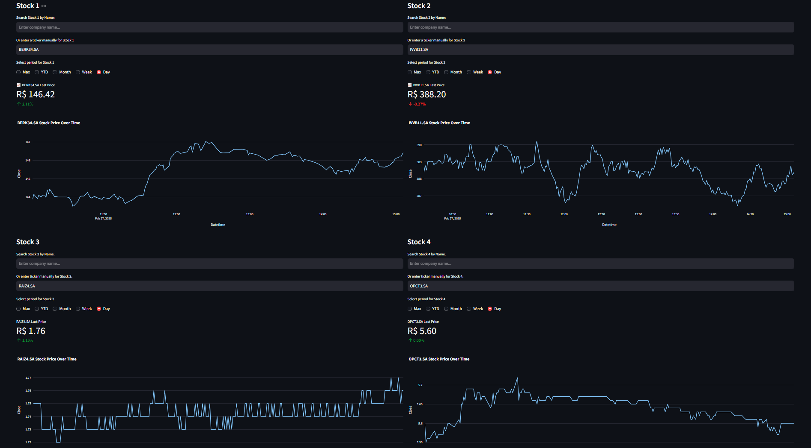

# Stock Dashboard 📈

Welcome to **Stock Dashboard**! This project aims to offer near real-time visualization of stock data for tickers of your choice. The application displays the current price, percentage change, and interactive charts to help you understand price trends. You can use this application locally and edit it to reflect the assets you want to monitor or evaluate new assets. Have your personal stock dashboard available wherever you are just clone the repository and run streamlit. 

--- 

## Application Tabs
### Dashboard Tab View 


### Comparison Tab View 


---

## 🚀 Your Personal Stock Dashboard – Fast, Easy, and Always Accessible! 📈  

Stay ahead of the market with **your own real-time stock dashboard**! Monitor any asset you choose, track live price updates, and visualize trends effortlessly – all from **any computer, anywhere**.  

With a sleek and interactive interface, this **plug-and-play dashboard** is designed for speed and convenience. No complex setups, no unnecessary steps – just **instant access to the financial insights that matter to you**.  

Whether you're keeping an eye on your portfolio or evaluating new opportunities, this tool is **fully customizable** to match your needs. Run it locally or deploy it to track your favorite stocks, BDRs, and ETFs with just a few clicks!  

---

### 🔹 Features:
- **Live price updates**
- **Instant percentage change tracking**
- **Dynamic charts for easy trend analysis**
- **Fully customizable – monitor what matters to you**
- **Lightweight & fast – access it from anywhere**

Start **making smarter decisions with real-time data, all in one place.** 🚀  

## Description

Stock Dashboard is developed in Python using functional programming principles and a modular architecture, ensuring ease of maintenance and replication. The application integrates:

- **Data Acquisition:** Utilizing the **yfinance** library to access free stock data from Yahoo Finance.
- **Data Processing:** Leveraging **Pandas** to manipulate the data and calculate percentage changes.
- **Real-Time Visualization:** An interactive dashboard built with **Streamlit** and **Plotly** that displays dynamic charts and updated information.

---

## Technologies Used 🚀

- **Python:** The programming language used for the project.
- **yfinance:** Library for fetching stock data from Yahoo Finance.
- **Pandas:** For data manipulation and analysis.
- **Streamlit:** Framework for creating interactive web applications.
- **Plotly:** Library for generating interactive charts.

---

## Prerequisites ⚙️

- Python 3.7 or higher
- Package manager `pip`

---

## Installation

1. **Clone the repository:**

   ```bash
   git clone https://github.com/thpgoncalves/stock-dashboard.git
   cd stock-dashboard

2. **Instal requirements**

   ```bash
   pip install -r requirements.txt

2. **Run Streamlit:**

   ```bash
   streamlit run dashboard.py

## Contact
How to get in contact with me:

[![LinkedIn][3.2]][3] - Thiago Gonçalves


[3.2]: https://raw.githubusercontent.com/MartinHeinz/MartinHeinz/master/linkedin-3-16.png
[3]: https://www.linkedin.com/in/thiago-pereira-goncalves/

Project Link: [https://github.com/thpgoncalves/stock-dashboard](https://github.com/thpgoncalves/stock-dashboard)
